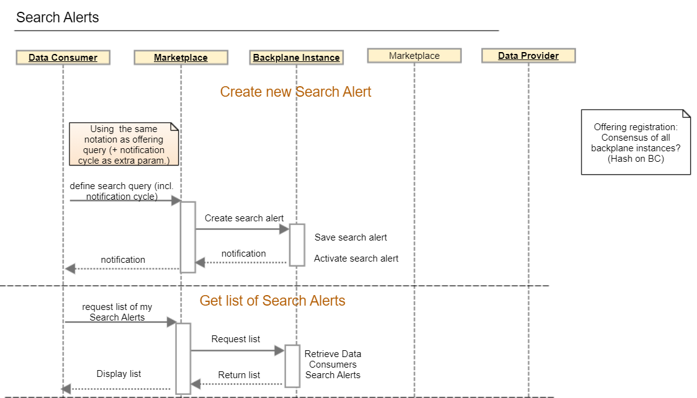
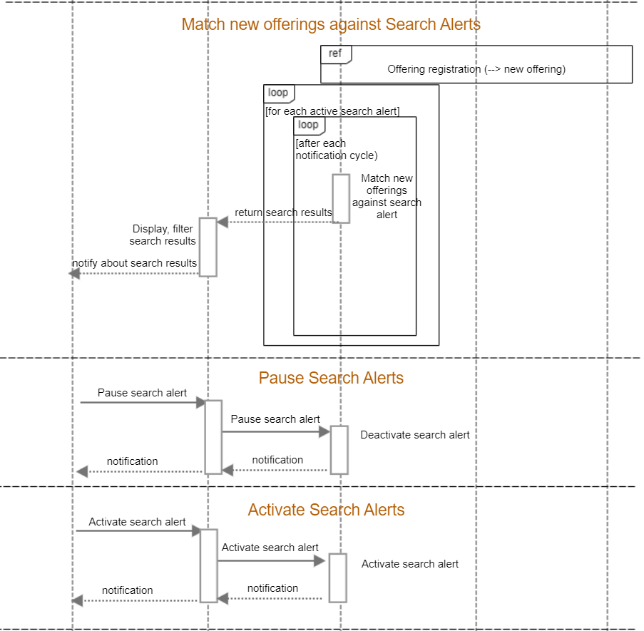
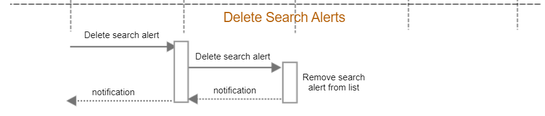

# [i3-market] Notification Manager

_en construcción..._
## Notifications API examples
sendNotification(action, status, origin, receptor, data)

* Notification (action, status, origin, receptor, data)

* Notification (action: New Search Hits, status: OK, origin: i3-market, receptor: datamarketplace_consumer, data = search results)

* Notification (action: Data Purchase Request, status: ok, origin: datamarketplace_provider, receptor: i3-Market)

* Notification (action: Data Purchase Request, status: Reject, origin: datamarketplace_provider, receptor: i3-Market)
 
* Notification (action: Accept Proposal, status: ok, origin: datamarketplace_provider, receptor: i3-Market, data = contractual parameters)

* Notification (action: Accept Proposal, status: Reject, origin: datamarketplace_provider, receptor: i3-Market)

* Notification (action: Activate Agreement, status: pending, origin: i3-Market, receptor: datamarketplace_consumer)

* Notification (action: Activate Agreement, status: ok, origin: i3-market, receptor: datamarketplace_provider, datamarketplace_consumer)

/v1/offering/notify()
/v1/offering/purchase()

/v1/offering/proposal/reject()
/v1/offering/proposal/accept()

/v1/offering/proposal/agreement()
/v1/offering/agreement/accept()

## UML

## Maintainers

- [diego.s](mailto:diego.s@hopu.org) - Software engineer and Data scientist
- [eleazar](mailto:eleazar@hopu.eu) - Software engineer